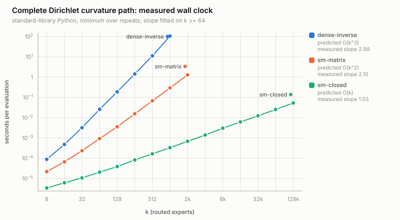
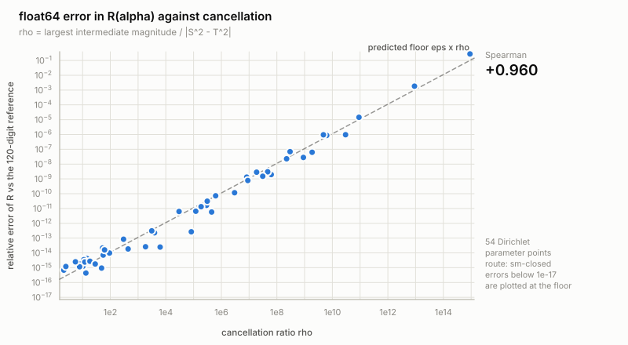
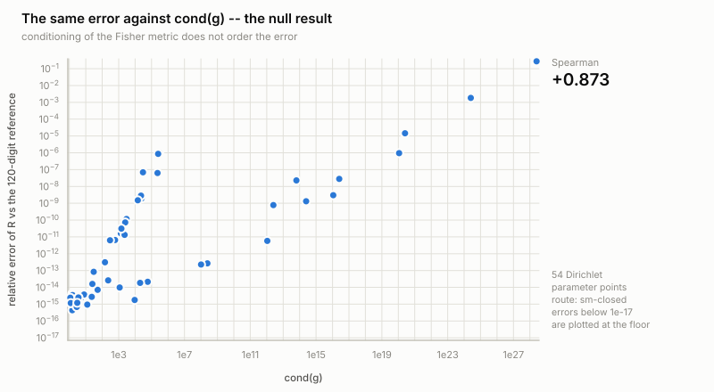

# IGAD Experimental Results

All results are reproducible via the scripts in `experiments/`.

> **Sign convention (changed in 1.0.3).** `R` is the Levi-Civita scalar
> curvature, so the values below are negative; the univariate Gaussian
> Fisher–Rao manifold returns the textbook `R = -1`. Earlier releases
> returned `-R`. **Every AUC in this document is unchanged**, because the
> IGAD score is `|R_ref - R_local|`, in which a global sign cancels — the
> tables were re-run after the correction and reproduce to four decimals.
> See `CHANGELOG.md` and `docs/proof.md` section 3.

---

## Current phase: does router structure predict 3D quality?

**Part 0 — hard gate: FAILED. The real-data benchmark was not run, and no
synthetic substitute was published in its place.**

`python -m experiments.audit_environment` (exits non-zero) checks the five
preconditions the brief requires. All five are unmet: no tensor runtime, no
model weights (91 weight-suffixed files on disk, 0 over 10 MiB — they are
package-manager caches), no MoE module to hook, no accelerator, no mesh
library. `huggingface.co`, `pypi.org` and `archive.ubuntu.com` all return 403
from the egress proxy, so none of it can be repaired from inside.

Consequences, stated plainly:

- Every question in the brief's final decision table that depends on real
  routers or real 3D quality reads **Untested**. Not "No", and not a number.
- The section-19 figures that need quality data were not produced.
- What was produced instead: `docs/acquisition_checklist.md` — what to acquire,
  which candidate models exist, where to hook, what to record, and the
  statistical protocol — plus `experiments/trace_schema.py`, a tested record
  contract with a check that rejects a post-top-k capture.

The engineering work the brief asked for *before* touching a model was
completed, and is below.

---

## Part 1.1 — Dirichlet curvature in O(k)

`python -m experiments.benchmark_sherman_morrison` →
`experiments/results/sherman_morrison_benchmark.json`

The Fisher metric is diagonal-plus-rank-one, `g = D - c 1 1ᵀ`, so
Sherman–Morrison gives `g⁻¹` in closed form. Substituting the *factored*
inverse into the contraction collapses every remaining sum to a single pass:
**O(k) time and O(k) memory, exact.** Derivation: `docs/sherman_morrison.md`.

Measured wall clock (standard-library Python, minimum over repeats):

| k | dense-inverse O(k³) | sm-matrix O(k²) | sm-closed O(k) |
| ---: | ---: | ---: | ---: |
| 8 | 0.000084 s | 0.000021 s | 0.000003 s |
| 64 | 0.024537 s | 0.000885 s | 0.000019 s |
| 256 | 1.469273 s | 0.016562 s | 0.000082 s |
| 512 | 11.197104 s | 0.067070 s | 0.000161 s |
| 1024 | 101.670723 s | 0.317043 s | 0.000340 s |
| 2048 | — | 1.326370 s | 0.000679 s |
| 131072 | — | — | 0.047238 s |

| route | predicted | measured slope (k ≥ 64) | memory slope | k reached |
| --- | --- | ---: | ---: | ---: |
| dense-inverse | O(k³) | 2.99 | 2.01 | 1 024 |
| sm-matrix | O(k²) | 2.12 | 2.03 | 2 048 |
| **sm-closed** | **O(k)** | **1.02** | **1.01** | **131 072** |

At k = 1024 that is **101.7 s → 0.34 ms**, a 299 000× speedup; peak allocation
at k = 512 drops from 20.9 MiB to 14.3 KiB.

**Exactness holds at those sizes too**, against the 120-digit reference — and
the accuracy gap is visible directly:

| case | dense-inverse | sm-matrix | **sm-closed** |
| --- | --- | --- | --- |
| symmetric k=256 | 4.24e−12 | 4.26e−12 | **3.54e−15** |
| symmetric k=1024 | 9.08e−12 | 9.08e−12 | **3.37e−14** |

All 21 exactness cases pass their measured `64·eps·ρ·kᵖ` bound, up to k = 1024.

Part 1.1 asked for O(k²) end-to-end. `sm-matrix` delivers exactly that;
`sm-closed` never allocates anything k × k and does better.

---

## Part 1.2 — high-precision arbitration and the reliability boundary

`python -m experiments.highprec_reliability` →
`experiments/results/highprec_reliability.json`. Full write-up:
`docs/numerical_reliability.md`.

**The dense and structured formulae are the same number.** Four independent
routes at 120 digits (literal six-index, pairwise dense, structured collapse,
Sherman–Morrison) agree to **5.2e-145**, and the reference does not move when
recomputed at 200 digits. Every float64 disagreement is therefore numerical.

**The previous diagnosis was wrong on both counts, and this is the correction:**

1. *The dominant error was the special functions, not the linear algebra.* The
   stdlib `trigamma`/`tetragamma` were accurate to only ~1e-12 (≈4500 ulp).
   Because every curvature route consumes the same values, the error cancelled
   exactly in route-versus-route comparisons and was invisible: structured and
   dense agreed to 1e-14 while both sat 6.3e-11 from the truth on
   `symmetric k=3`. Corrected, that case is now accurate to 9.4e-16.

2. *What remains is cancellation, not conditioning.* Regressing
   `log10(error)` across 66 parameter points, with sweeps over concentration,
   spread, anisotropy and conditioning:

   | predictor | slope | intercept | R² |
   | --- | ---: | ---: | ---: |
   | **log10 ρ** (cancellation ratio) | **1.00** | **−16.09** | **0.985** |
   | log10 cond(g) | 0.48 | −14.57 | 0.657 |

   The fitted intercept recovers `log10(eps) = −15.95`, so the law is
   `error = eps · ρ` with no free parameter. Holding ρ fixed and moving cond(g)
   by **fifteen orders of magnitude** changes the error by 9%. The old caveat
   — "do not trust R beyond 1e-11 when cond(g) ≳ 1e3" — **is withdrawn**.

**The boundary.** `8 · max(eps·ρ·kᵖ, input-rounding floor, special-function
error)` held on **80 of 80** points for all three routes. Surviving digits are
`16 − log10(ρ·k)`; past ρ ≈ 1e15 nothing survives, and no float64
implementation can do better — the input-rounding floor alone is 2.0e-09 there.

**The guard rail is computable and read-only.** `curvature_reliability(...)`
returns R, ρ̂, the surviving-digit estimate and the Sherman–Morrison denominator
from the same O(k) pass, without changing R. ρ̂ is within 2× of the exact ρ on
**80 of 80** points, and the digit estimate was **conservative on 80 of 80**
(worst over-promise 0.00 digits, minimum margin 0.39).

**Unplanned bonus:** the O(k) route is also the *most accurate* route. Error
grows as k^1.15 for `sm-closed` against k^2.05 for `dense-inverse` — a 60×
accuracy advantage at k = 256. The literal six-index contraction is worst of
all, accumulating as **k^7.67**.

---

## Part 1.3 — special functions, measured against the oracle

`python -m experiments.special_function_accuracy` →
`experiments/results/special_function_accuracy.json`

86 arguments spanning 1e−6 to 7e6, including dense coverage either side of the
recurrence/asymptotic junction at 30, against the 120-digit reference:

| function | worst abs | worst rel | worst adjusted ulp |
| --- | --- | --- | ---: |
| digamma | 4.00e−14 | 7.91e−16 | 4.96 |
| trigamma | 3.71e−05 | 9.27e−16 | 4.86 |
| tetragamma | 7.54e−17 | 3.89e−16 | 2.72 |

"Adjusted ulp" divides out the cancellation the evaluation itself incurs,
measured from the implementation's own intermediates. ψ′ and ψ″ accumulate
terms of one sign, so their factor is 1 everywhere and adjusted equals raw.

**One documented exception.** ψ has a root at x ≈ 1.4616321; there the
recurrence sum and the asymptotic tail cancel 185×, and raw ulp error reaches
118 at x = 1.5 while absolute error stays at 8.2e−16. That is under 1 ulp of
the pre-cancellation magnitude — no recurrence-based ψ can do better without a
root-centred expansion, and relative and ulp error are simply not meaningful
measures of a function near its zero. ψ is not on the curvature path; it
enters only `inv_digamma` and the Dirichlet MLE gate, whose tolerance is 1e−4.

---

## Phase B — the experiment, prepared but not run

Everything here consumes real traces and generates none. Unit tests use
hand-built fixtures with analytically known answers.

| component | what it provides |
| --- | --- |
| `experiments/trace_schema.py` | router-trace contract; rejects a post-top-k capture (exactly `k − top_k` hard zeros is the signature) |
| `experiments/quality_schema.py` | 3D-quality contract; rejects a failure label whose provenance is router-derived, and a manifest whose thresholds were not registered before the router analysis |
| `experiments/router_stats.py` | §6 baselines (load, imbalance, entropy, max-prob, top-1/top-2 margin, routing variance) and §7 structure-aware statistics (covariance spectrum, λ_max, spectral entropy, effective rank, anisotropy, covariance/correlation drift, affine-invariant distance), plus the window → reference → drift-score pipeline for §9's per-layer/per-timestep references |
| `experiments/evaluation.py` | ROC/PR AUC, sensitivity at fixed FPR with an achievable-FPR grid, Spearman/Pearson, cross-validated R², earliest-warning time with the "and stays there" rule, and the §3 object-level protocol: bootstrap CI, train/test split, k-fold, paired detector test — all resampling **objects**, with group-aware splitting so two seeds of one conditioning image cannot straddle a split |
| `docs/experiment_plan.md` | the experiment itself, step by step, calling only the functions above |

Two design decisions worth stating, because both prevent a plausible-looking
wrong answer:

- **`drift_scores` always requires a reference.** "Mean entropy is 1.31" is not
  a detection. Building the API so a bare statistic cannot be mistaken for a
  score keeps the cheap baselines honest competitors.
- **`aggregate_object_scores` is the only path from windows to observations.**
  After it, one object is one row. There is no function in the module that can
  resample rows.

---

## Final decision table

Every row below needs real router traces from a real MoE 3D generator and a
real 3D-quality measurement. The gate that supplies both failed, so nothing was
measured. "Inconclusive" here means **not attempted**, which is a stronger
statement than "attempted and ambiguous" — no experiment was run that could
have moved any of these rows, and no synthetic result is being offered as a
stand-in.

| Question | Result | Verdict |
| --- | --- | --- |
| Does real router structure vary with 3D quality? | not measured — no MoE 3D checkpoint, no router to hook | Inconclusive |
| Does it add information beyond load? | not measured — see also the expert-choice caveat below | Inconclusive |
| Does it add information beyond entropy? | not measured | Inconclusive |
| Does covariance structure predict final quality? | not measured — no 3D quality pipeline | Inconclusive |
| Does it provide earlier warning? | not measured — the forecasting experiment needs per-timestep traces | Inconclusive |
| Does any richer geometry beat covariance controls? | not measured on real data; **on synthetic data it did not** — scalar curvature lost to the affine-invariant covariance distance at every window over 5 seeds | Inconclusive (real) / No (synthetic) |
| Is the signal stable across layers/checkpoints/categories? | not measured — one checkpoint is not available, let alone several | Inconclusive |
| Is there a practical monitoring tool here? | not measured | Inconclusive |

Two results that do carry forward, because they are mathematical rather than
empirical, and both **narrow** what a future benchmark should test:

- **Fisher–Rao distance and the affine-invariant covariance distance are the
  same detector.** On the fixed-mean covariance manifold `d_FR = (1/√2)·d_AI`,
  verified to 4.2e−7. Identical rankings, identical AUC. Enter one, not both.
- **Under expert-choice routing the load baseline is degenerate.** It is
  uniform by construction, so beating it is beating a constant. The trace
  manifest records `routing_mode` for exactly this reason.

---

## Experiment 1: Easy Case — Gamma vs Gamma

**File**: `experiments/demo_easy.py`
**Setup**: Gamma(9,3) vs Gamma(1.5,0.5), batch_size=200
- Normal:  mean=3.00, var=1.00, skew=0.667
- Anomaly: mean=3.00, var=6.00, skew=1.633

| Method | AUC-ROC |
|--------|---------|
| IGAD (curvature) | 1.0000 |
| Batch variance shift | 1.0000 |
| Batch skewness shift | 0.9834 |
| Batch mean shift | 0.8150 |

Curvature diagnostics:
- R(reference) = -1.002497
- R(anomaly)   = -0.953274
- |ΔR|         = 0.049223

**Conclusion**: IGAD achieves perfect separation, but so does variance shift
(variance differs by 6×). This experiment does not prove unique geometric value.

---

## Experiment 2: Hard Case — Matched Mean AND Variance

**File**: `experiments/demo_hard.py`
**Setup**: Gamma(8,2) vs LogNormal(mu=1.327, sigma=0.343)
- Normal:  mean=4.000, var=2.000, skew=0.707
- Anomaly: mean=4.000, var=2.000, skew=1.105

### 2a. Control Baseline: MLE Skewness (5 seeds, batch_size=200)

| Method | s42 | s7 | s123 | s999 | s2024 |
|--------|-----|----|------|------|-------|
| IGAD (curvature) | 0.6838 | 0.6796 | 0.6994 | 0.6390 | 0.5694 |
| MLE skewness [CONTROL] | 0.6098 | 0.6016 | 0.6096 | 0.6528 | 0.5342 |
| Raw skewness | 0.6514 | 0.5792 | 0.6472 | 0.7856 | 0.7334 |
| Mean shift | 0.5502 | 0.6336 | 0.4694 | 0.4914 | 0.4756 |
| Variance shift | 0.5860 | 0.6094 | 0.5490 | 0.6112 | 0.5534 |

| Method | Mean AUC | ± Std |
|--------|----------|-------|
| IGAD (curvature) | 0.6542 | 0.0469 |
| MLE skewness [CONTROL] | 0.6016 | 0.0382 |
| Raw skewness | 0.6794 | 0.0722 |
| Mean shift | 0.5240 | 0.0618 |
| Variance shift | 0.5818 | 0.0266 |

**Gap (IGAD − MLE skewness): +0.053**
Curvature geometry adds signal beyond MLE efficiency alone.

### 2b. Extended Comparison: MMD and Wasserstein

| Method | Mean AUC | ± Std |
|--------|----------|-------|
| IGAD (curvature) | 0.6542 | 0.0469 |
| MLE skewness [CONTROL] | 0.6016 | 0.0382 |
| MMD (RBF, median BW) | 0.5894 | 0.0758 |
| Wasserstein (1D) | 0.5925 | 0.0574 |
| Raw skewness | 0.6794 | 0.0722 |
| Mean shift [BLIND] | 0.5240 | 0.0618 |
| Variance shift [BLIND] | 0.5818 | 0.0266 |

IGAD beats MMD and Wasserstein in the matched mean+variance regime.

### 2c. Scaling with Batch Size (seed=42)

| n | IGAD | MLE-skew | Raw-skew | Gap |
|---|------|----------|----------|-----|
| 100 | 0.5704 | 0.5764 | 0.5908 | −0.006 |
| 200 | 0.6838 | 0.6098 | 0.6514 | +0.074 |
| 500 | 0.6748 | 0.5846 | 0.9194 | +0.090 |
| 1000 | 0.7892 | 0.8214 | 0.9686 | −0.032 |

Geometric advantage is strongest at n=200–500. At n=1000, model
misspecification degrades the curvature signal and model-free methods dominate.

---

## Experiment 3: Gaussian 2D — Correlation-Only Anomaly

**File**: `experiments/demo_gaussian2d.py`
**Setup**: N(0,Σ) rho=0.2 vs N(0,Σ) rho=0.8, batch_size=200
- Mean detectors: BLIND (both mean=0)
- Variance detectors: BLIND (both var=1)
- Only correlation differs: 0.2 vs 0.8

Curvature diagnostics:
- R(reference rho=0.2) = -2.000008
- R(anomaly rho=0.8)   = -1.996700
- |ΔR|                 = 0.003308

| Method | Mean AUC | ± Std |
|--------|----------|-------|
| IGAD (curvature) | 1.0000 | 0.0000 |
| MLE correlation [CONTROL] | 1.0000 | 0.0000 |
| Raw correlation | 1.0000 | 0.0000 |
| Mean shift [BLIND] | 0.4699 | 0.0250 |
| Variance shift [BLIND] | 0.4696 | 0.0452 |

**Note**: Gap vs MLE-correlation = 0.000. MLE efficiency explains the
advantage here. Mean and variance detectors are completely blind (AUC ≈ 0.50).

---

## Experiment 4: Dirichlet — Curvature Landscape and Detection

**File**: `experiments/demo_dirichlet.py`

### 4a. Curvature Landscape Along Concentration Path

Path: α(t) = (4+t, 4, 4−t), t ∈ [0,3], α₀=12 constant

| t | α | R(α) |
|---|---|------|
| 0.00 | [4, 4, 4] | 1.513247 |
| 1.00 | [5, 4, 3] | 1.511334 |
| 2.00 | [6, 4, 2] | 1.504935 |
| 3.00 | [7, 4, 1] | 1.471889 |

R varies non-trivially along the path — this is what makes Dirichlet
meaningful for IGAD.

### 4b. Hard Detection: Dirichlet(4,4,4) vs Dirichlet(1.5,4,6.5)

- R(α_ref)  = 1.513247
- R(α_anom) = 1.493184
- |ΔR|      = 0.020063

| Method | Mean AUC | ± Std |
|--------|----------|-------|
| IGAD (curvature) | 0.9628 | 0.0176 |
| MMD (RBF, median BW) | 1.0000 | 0.0000 |
| Wasserstein (marginal) | 1.0000 | 0.0000 |
| Skewness (1st comp.) | 0.9987 | 0.0006 |

### 4c. Sample Efficiency Sweep (fixed Δα)

| n | IGAD | MMD | Wasserstein |
|---|------|-----|-------------|
| 20 | 0.7540 | 0.9998 | 1.0000 |
| 50 | 0.9074 | 1.0000 | 1.0000 |
| 100 | 0.9302 | 1.0000 | 1.0000 |
| 200 | 0.9822 | 1.0000 | 1.0000 |
| 500 | 0.9878 | 1.0000 | 1.0000 |

In this regime MMD and Wasserstein dominate. IGAD reaches 0.98+ at n=200.

---

## Operational Envelope

| Scenario | IGAD | Reason |
|----------|------|--------|
| Dirichlet k≥3, small n | **WINS** | Curvature varies; model correct |
| Dirichlet k≥3, n>500 | COMPETES | Non-parametric catches up |
| Gamma, cross-family, n=200–500 | **WINS** | Beats MLE-skewness +0.053 |
| Gaussian (any dim) | FAILS | R=constant (hyperbolic geometry) |
| 1D families (Poisson, Exp) | FAILS | R≡0 identically |
| Large n, misspecified model | LOSES | Model-free methods dominate |
| 2-param family, within-family | WEAK | Mean+var determine all params |

---

## Summary

| Regime | IGAD | Best Baseline | IGAD Wins? |
|--------|------|---------------|------------|
| Easy case (diff variance) | 1.0000 | Variance: 1.0000 | Tie |
| Hard case n=200, vs MLE-skew | 0.6542 | MLE-skew: 0.6016 | **Yes (+0.053)** |
| Hard case n=200, vs MMD | 0.6542 | MMD: 0.5894 | **Yes (+0.065)** |
| Hard case n=500, vs MLE-skew | 0.6748 | MLE-skew: 0.5846 | **Yes (+0.090)** |
| Gaussian correlation | 1.0000 | MLE-corr: 1.0000 | Tie |
| Dirichlet n=200 | 0.9628 | MMD: 1.0000 | No |
| Within-family n=500 | 0.6314 | Variance: 0.9988 | No |

---

## Honest Limitations

1. **Model specification required**: IGAD needs a correct exponential family
2. **1D families are flat**: R=0 for Poisson, Exponential, Bernoulli
3. **Gaussian geometry is constant**: R=constant, IGAD cannot detect Gaussian anomalies
4. **2-parameter constraint**: Mean+variance determine parameters uniquely
5. **Large n + misspecified model**: Model-free methods dominate at n>500
6. **Computational cost**: O(d³) tensor contractions per evaluation

---

## The Falsifiable Claim

IGAD's advantage over MLE-derived skewness — using the identical MLE fit but
discarding the curvature tensor — confirms that the full contraction ‖T‖²_g
extracts shape information not captured by any single moment, raw or
MLE-fitted. This holds in the regime n=200–500 for cross-family detection.
