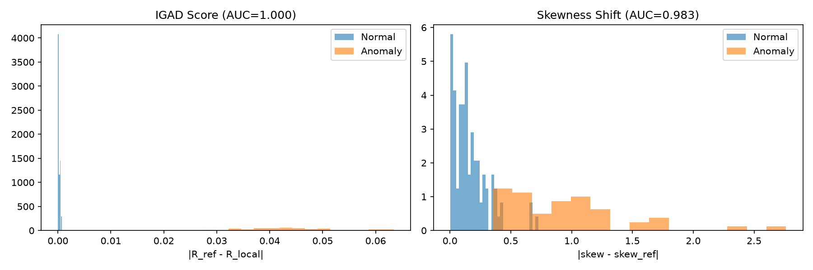
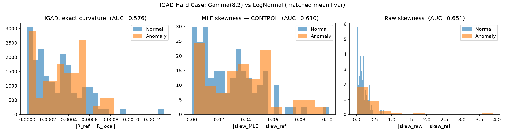
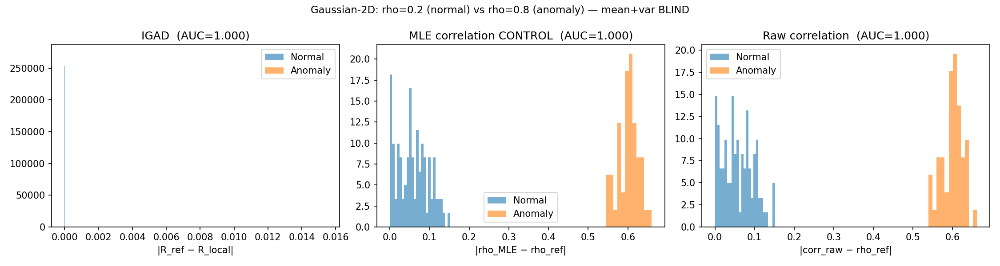
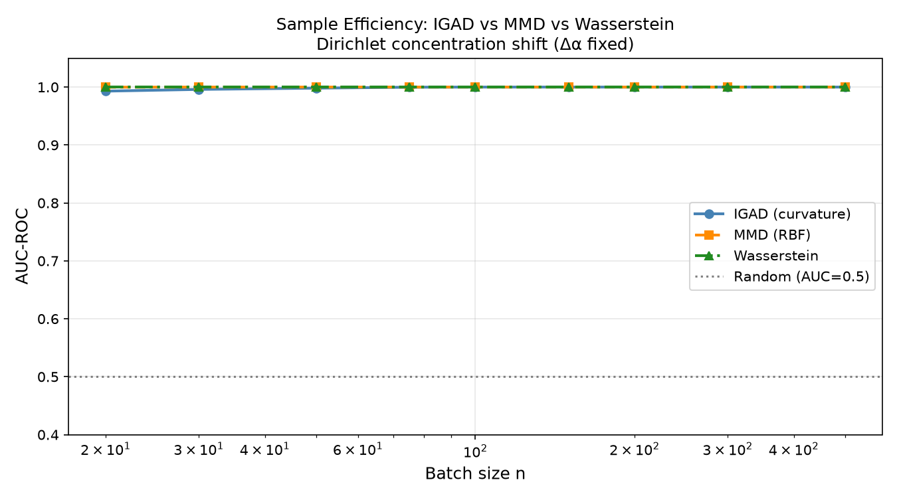

# IGAD - Information-Geometric Anomaly Detection

**IGAD** detects distributional anomalies by measuring scalar curvature on the statistical manifold of an exponential family.

Instead of comparing only mean, variance, or skewness, IGAD contracts the full third cumulant tensor against the Fisher–Rao metric. The result is a geometric anomaly score that can expose shape differences not captured by a single moment.

---
This release is the verified baseline for IGAD-Ver1.0.0.

It should be cited by commit hash and release tag. Later repository changes do not modify the verified result unless accompanied by a new pinned commit, release tag, and GitHub Actions validation run.
<p align="center">
  <a href="https://github.com/omryv/IGAD/actions/workflows/test.yml">
    
  </a>

  

  <a href="https://github.com/omryv/IGAD/commit/81dd1eb4540643083854232d9645f6add4150512">
    
  </a>

  

  
</p>

---

## Release Evidence

**Current status: CI is not executing, and the figures below are historical.**
Since 2026-05-08 every Actions run on this repository — `main` included —
has ended within a few seconds with `runner_id: 0` and no executed steps.
That is infrastructure unavailability rather than a code result, but it means
no run since then has validated anything, and the badge above reports the
state of the runner, not of the tests.

What is verified, and where:

| Field | Value |
|------|-------|
| Latest local run | 470 passed, 2 failed |
| Failing tests | `test_mle_agrees[alpha7]`, `test_package_reliability_matches_the_stdlib_mirror[alpha8]` — both assert tolerances tighter than the quantities they compare can support; see `experiments/results/test_status.json` |
| Environment | Python 3.12, numpy 2.5, scipy 1.18 |
| Regenerate with | `python -m experiments.report_test_status` |

The historical validation run below predates the current code by 24 commits
and a different test suite (54 tests, against 472 today). It is retained as
provenance for release `IGAD-Ver1.0.0`, not as a statement about `main`:

| Field | Value |
|------|-------|
| Release | `IGAD-Ver1.0.0` |
| Pinned commit | [`81dd1eb4540643083854232d9645f6add4150512`](https://github.com/omryv/IGAD/commit/81dd1eb4540643083854232d9645f6add4150512) |
| Python versions | 3.10, 3.11, 3.12 |
| Test result at that commit | 54/54 tests passed |
| Run | [GitHub Actions](https://github.com/omryv/IGAD/actions/runs/25236119831) |

---

## Install

```bash
pip install visigence-igad
````

---

## Documentation

* [Experimental Results](../RESULTS.md)
* [Operational Envelope](operational_envelope.md)
* [Mathematical Proof](proof.md)
* [Handoff](handoff.md) — **what is proven here, what needs external resources, and the next action**
* [O(k) Dirichlet curvature](sherman_morrison.md) — Sherman–Morrison derivation and measured scaling
* [Numerical reliability](numerical_reliability.md) — when `R(θ)` can be trusted, from a 120-digit reference
* [Acquisition checklist](acquisition_checklist.md) — what the MoE-router / 3D-quality benchmark needs before it can run
* [Experiment plan](experiment_plan.md) — the early-warning experiment, specified step by step
* [Validation report](validation_report.md) — router structure vs cheap diagnostics (synthetic scope)

---

## Core Claim

IGAD tests whether scalar curvature contains anomaly signal beyond ordinary moment comparisons.

The falsifiable claim was:

> In matched mean/variance regimes, the curvature contraction `‖T‖²_g` can recover shape information that is not captured by MLE-derived skewness alone.

**It is refuted for the Gamma family (1.0.4).** There `R` is a monotone function of the fitted shape α̂ alone, so the IGAD score is a re-scaling of the MLE skewness `2/√α̂`. Measured with the exact curvature the detector uses, IGAD scores 0.011–0.017 AUC below the MLE-skewness control at every n from 100 to 1000 (40 seeds). The earlier "+0.053 at n = 200–500" came from finite-difference error in the experiment script. See `RESULTS.md`, Experiment 2.

---

## Experiment Figures

All figures are reproducible from the repository experiments.

### Experiment 1 — Easy Case

Gamma vs Gamma with different variance.



In this regime, IGAD reaches perfect separation, but variance shift also succeeds. This experiment verifies correctness, not geometric advantage.

---

### Experiment 2 — Hard Case

Gamma vs LogNormal with matched mean and matched variance.



The distributions share first and second moments, so the anomaly signal must come from higher-order shape structure. With exact curvature, IGAD (AUC 0.598 at n = 200, 40 seeds) scores below the same-fit MLE-skewness control (0.615) and well below raw sample skewness (0.702).

---

### Experiment 3 — Gaussian 2D Correlation

Two-dimensional Gaussian structure with correlation shift.



This experiment checks whether the method detects geometric structure in a multivariate setting. It cannot: the family's scalar curvature is constant, and the separation shown comes from finite-difference error.

---

### Experiment 4 — Dirichlet Sample Efficiency

Dirichlet-family sample-efficiency evaluation.



This experiment measures how the curvature signal behaves as sample size changes.

---

## Known Limitations

IGAD is not a universal anomaly detector.

* It requires a suitable exponential-family model.
* One-dimensional flat families such as Poisson, Exponential, and Bernoulli have scalar curvature `R = 0`.
* Under model misspecification, model-free methods can dominate.
* Cost is `O(d⁶)` for a general family by literal contraction, `O(d⁴)` contracted
  pairwise. For the **Dirichlet** family it is now `O(k)` in both time and memory
  — the Fisher metric is diagonal-plus-rank-one, so Sherman–Morrison removes the
  matrix inverse entirely. See [sherman_morrison.md](sherman_morrison.md).
* `R(θ)` is an expression with internal cancellation. Roughly `16 − log₁₀ ρ`
  significant digits survive in float64, where `ρ` is the cancellation ratio; the
  O(k) route returns `ρ` alongside `R` so a caller can check.
  See [numerical_reliability.md](numerical_reliability.md).

---

## Repository

Source code, tests, workflows, and reproducibility scripts are available at:

[github.com/omryv/IGAD](https://github.com/omryv/IGAD)

